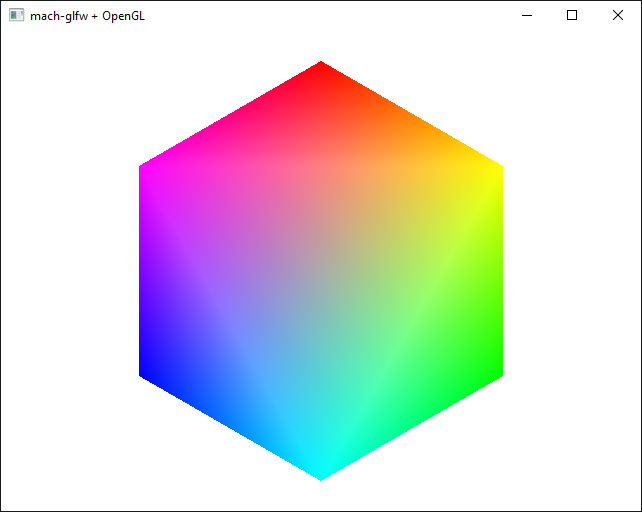

# mach-glfw OpenGL example

This is an example for how to use [mach-glfw](https://machengine.org/pkg/mach-glfw/) together with [zigglgen](https://github.com/castholm/zigglgen) to create a window and draw to it using modern OpenGL 4.1 (the last version supported on macOS).

This example works with the `zigup 0.13.0-dev.351+64ef45eb0`/`2024.5.0-mach` version of the Zig compiler. See [Nominated Zig versions](https://machengine.org/about/nominated-zig/#202450-mach) for instructions on how to install the correct version of the compiler.



## Getting started

### Clone the repository

```sh
git clone https://github.com/hexops/mach-glfw-opengl-example

cd mach-glfw-opengl-example
```

### Run the example

```sh
zig build run
```

## Next steps

### Understanding this example

This example draws a simple colored hexagon to the screen that rotates slowly. It shows you how to

- create an OpenGL-enabled GLFW window,
- initialize the OpenGL bindings,
- compile a simple shader program,
- define vertex data using `extern struct` and upload it to the GPU along with instructions for how it's laid out in memory, and finally
- draw to the screen in a main update loop.

### Understanding why zigglgen is required

Unlike many other libraries which you link your program with at compile or load time, OpenGL is implemented as a set of functions that your program must query the windowing system for at runtime. OpenGL doesn't help you with this and you are expected to handle loading all the functions you need yourself.

A non-trivial OpenGL program might use several dozen different functions, so the way most developers get around having to write all this code is by using a binding generator that automatically generates the necessary function loading code. [zigglgen](https://github.com/castholm/zigglgen) is one such binding generator that is written in Zig and integrated with the Zig build system.

## Getting help

You can ask the [Mach community on Discord](https://discord.gg/XNG3NZgCqp) for help if this example doesn't work. You might also want to consider joining the [Zig Programming Language Discord](https://discord.gg/zig)'s `#gamedev` channel.
